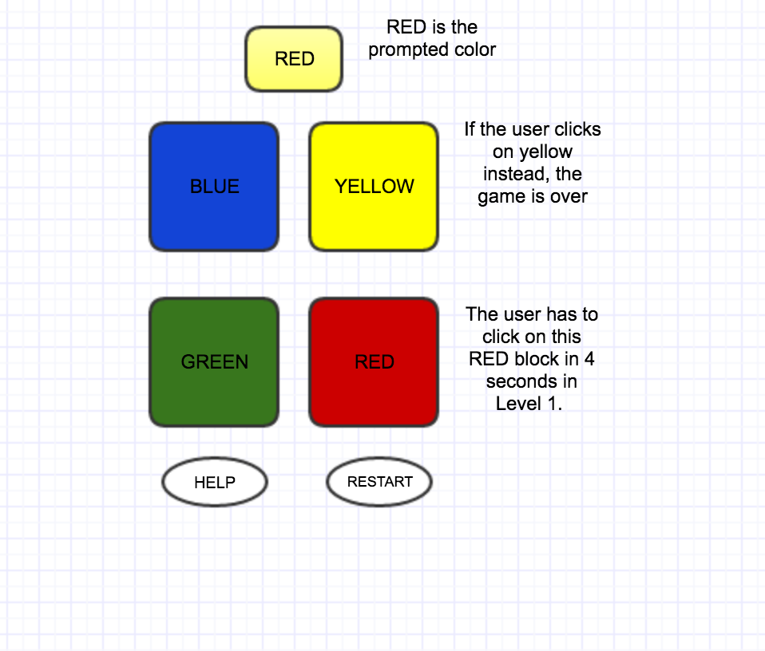

## Gayathri Sriram / 04.11.2017

# STROOP GAME Proposal

## What is STROOP Game?

- I am proposing to make a STROOP GAME in which the user will be given blocks of color and will be propmpted to choose any one of the colors, may or may not be on the given blocks.

- This action has to be done in just one second

- If the user fails to match the prompted color with the block, the game is over and the user has to restart.

- There are possibilities that the user may even get a color that are not on the blocks. In such cases, the user is not supposed to click any of the blocks.

- The user wins when he keeps choosing the right block for the prompted color.
 

### Wireframe

|Element    |    Aspects    |
| ------------- |:-------------:|
|Base:    |Browser Window|
|Player Input:   | Click on the blocks|
|Player Output:  | Instructions of the game and 4 blocks and a timer.|

### Initial thoughts on game structure

### Functions & arrays 
I am planning to create each and every block as divs and call each of them using functions. 

So whenever the user clicks , the click is captured and evaluates with the color prompted and these values are stored in an array. So here when the user's chosen block and the prompted word is evaluated by accessing them through an array. As the values captured are going to be colors, I have used the lowerCase function to get the results precisely.

If they match the user gets on to the next propmt and if it doesn't the action terminates to restart the game.

### Points & context-specific actions:
10 points for every correct block and the user can restart the game once it's over.

### Phases of Completion

### Level One:
In this level of the game the user has to choose the right blocks in 2 seconds.

Every time the player chooses the right block, the score gets added by 10.

### Links and Resources

W3Schools
StackOverFlow
Reffered CodePen to get an idea of several games.